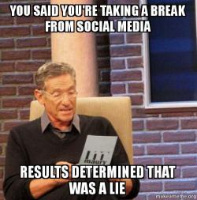

## The Impact of Social Media on Mental Health

**Do you have social media?**

**How much time do you spend on social media?**

**How many social media apps do you have?**

Nowadays, social media has become an integral part of everyday life. Do you want to keep in touch? Let’s follow each other on Instagram! What are you up to? Send me a snap! The amount of time we spend on social media has taken up such a large part of our social life that it is one of the most used ways people connect with each other. 

However, social media has offered the opportunity for people to create a carefully crafted online image of themselves rather than reflecting reality. People would only like to post about the highlights of their life, while we oftentimes ignore the mental health issues that lie underneath the filters and follower counts. This would only exacerbate the underlying social hierarchy on digital platforms, which would indirectly lead to social anxiety amongst users and worse mental health issues such as depression. In this data analysis, we aim to investigate the impact of social media on mental health, specifically concerning the young generation under forty years old. To back up our analysis, we have gathered and organized three large datasets: social media usage of 15-40-year-olds in Bangladesh, 17-22-year-olds in the United States, and 15-23-year-olds in India during the COVID-19 lockdown.

From this analysis, we have found that people spend as much as nine hours a day on social media, and the number can go even higher during the pandemic lockdown. Although there is not a clear causal relationship between social media usage and mental health issues, there is a correlation in that the more time people spend on social media, the more social anxiety and depression they feel within that period of time. This shows that the increased social media usage did not open up more doors in people’s social life, but rather took away the in-person social connection that people originally have by connecting face to face, one on one. 

Therefore, the key takeaway from this data analysis is that social media indirectly exacerbates mental health issues concerning people’s social interactions. As much as the advancement of technology brings us this new way of connecting with people, it is important to acknowledge the negative impacts that social media brings to the table and take the necessary steps to handle the negative influences. We encourage people to take the time off from social media and have more in-person conversations with others to ensure that social media is a healthy and resourceful tool. 

