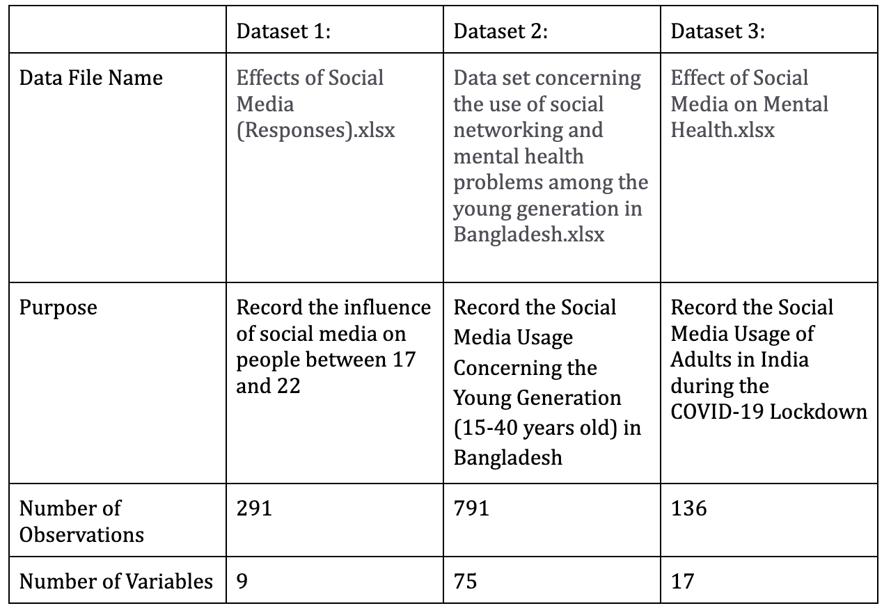

# Effects of Social Media on Mental Health

1. Code Name: a Team ( "a" sound as [ə])
2. Authors:

- Cindy Fu (yuxinfu@uw.edu)
- Qinghui Xie (qxie@uw.edu)
- Haipei Chen (hpia22@uw.edu)

3. Affiliation: INFO-201: Technical Foundations of Informatics - The Information School - University of Washington
4. Date: Autumn 2022
5. Keywords: (3-5 keywords)

- mental health, social media, technology, depression, withdrawal;

---

## Abstract

Our main question is **understanding how social media affects our mental health**. This question is important because, in our current generation, almost everyone with technology is exposed to social media. To address this, we will create visuals of patterns and correlations between social media use and user characteristics and trends.

## Introduction

Our project focuses on the effects of social media on mental health. Social media has become very prominent in the last decade creating a place of comfort for some and sadness for others. Through our datasets, we want to showcase how it has affected the majority of the population and create awareness of how much impact social media has on people, especially the current generation that has grown up with exposure to social media. There are different types of social media exposure such as media/current event awareness, lives of individuals, status updates of celebrities, and much more. For many, it may be a personal diary, while others showcase their work. We will be using this project to explore and learn more about these users.

## Problem domain

Over the past decade, social media has been one of the most popular communication tools with approximately 3 billion social media users worldwide. Amongst them, adolescents and young adults are the most active users of social media(Schønning, 2020). From instant messaging to posting life updates, social media allows you not only to share your life with the people you are already close with, but also craft an online image for those who want to get to know you more. This is where the discrepancy lies: an online social media portfolio sometimes does not match how one is like in reality. This leads to teenage problems such as body image issues, imposter syndrome, and comparison of follower counts, which would potentially harm one’s self-esteem and mental health. Research says, “facebook usage increases users' engagement in social comparison and consequently decreases their happiness”(Arad, 2017). These consequences are especially exacerbated by the ongoing COVID-19 pandemic when everyone is isolated in their digital world. Therefore, it is important to investigate the correlation between social media usage and its effects on mental health among teenagers and adolescents.

- ### Direct and Indirect Stakeholders
  For this project we are going to work on, people who are interested in the positive and negative effects of social media are our **direct stakeholders**. They are the users of our website, using it to get a solid understanding of social media from data.
  The people who participated in the google forms and generated the data we analyzed on our website are the indirect stakeholders. Also, those who are on social media can also be our **indirect stakeholders**. Their activities are recorded in our data and they are represented as part of the visualization we present.
- ### Human Values
  Our projects focus on human intimacy and well-being. We might think that social media bonds us closer. On the other hand, it can also isolate us and make us feel depressed or stressed from seeing all the information online. Our project tries to present the influence of social media with solid data. In the end, we hope users can realize the negative impact of social media and better regulate their use of it.
- ### Potential Benefits and Harms
  Our projects can be beneficial to people because we use solid data to remind people once again that social media is a double sword. While we can build relationships with more people using social media, too much time on social media might lead to depression, stress, etc. Social media might allow us to share lots of precious moments with our friends. On the other hand, research has found that the intention to share before or during an experience can undermine enjoyment(Barasch, 2017).
  However, since we are not specific to a particular social media software or a group of people, we might over-generalize things in our project. This is a potential harm to our project because it can lead to a degree of misrepresentation. Also, the influence of social media on people can be depended on lots of factors. Our data about social media is often regional data with limited categories. Experiences of people living in different countries can experience distinct online environments. Thus, we might be failed to present the accurate influence of social media.

## Research questions

1. How does social media trends affect the rise or decrease of depression?

- This is the question that is most commonly asked or thought about when using social media. Many parents and guardians don’t allow their children to use social media at a young age because they know of the detrimental effects it can cause to their children.

2. Is there a correlation between the rise of social media usage and teenage mood levels?

- As mentioned in the introduction, social media can bring about happiness or sadness. Which is more prominent is unknown to us which leads us to explore this question with our dataset.

3. Does withdrawal from social media exist and how severe is it?

- Social media is an addiction just like anything else and for every addiction, there may be withdrawals. We want to take a look into what happens after the cease of social media after prolonged use and how it affects individuals differently.

4. How are the young generation, particularly from 17 to 22, influenced by social media both physically and mentally?

- Through data analysis, we wish to understand how social media can influence the physical activities of the young generation. Besides, social media is filled with different information. We want to see how much inappropriate information they have been exposed to that can influence them mentally.

## The dataset

### Dataset 1: Data of Usage of Social Media by Students Between Age 17-22

1. Description:
   This dataset provides data about the time students on social media and on physical activities. By comparing these two categories of data, we can learn if students are getting enough exercise for their physical well-being. Also, we can use this dataset to understand how much inappropriate content they got from the social media platforms they use. If students are getting too much inappropriate information, it can also influence their mental health condition.

2. Provenance:
   Maheep Mahat was the creator of this dataset in 2018. There aren’t any people funded for this project. The creator of this project seems to be the only person who benefits from this data. The disappointing news is that we are not sure of either the source or how the creator got this data. Therefore, this data can be not trustworthy. I obtained the data by simply downloading it.

Data of usage of social media by students between age 17-22 - dataset by Maheepmahat. data.world. (2018, September 8). Retrieved October 31, 2022, from https://data.world/maheepmahat/data-of-usage-of-social-media-by-students-between-age-17-22

### Data Set 2: Data of Social Media Usage Concerning the Young Generation (15-40 years old) in Bangladesh

1. Description:
   This dataset provides information about the social media usage among adolescents. By organizing the information and sorting the observations into age groups, it is possible to find the correlation between mental health and social media usage. The data provided are qualitative and quantitative data that is possible to make inferences about the effects of social media.

2. Provenance:
   Researchers from the University of Asia Pacific, Dhaka, have collected data from across Bangladesh. The dataset is the raw data that researchers have collected to investigate how mental health problems in the young generation in Bangladesh correlate to their social media usage. The data collected were responses to self-reported questionnaires using Google Surveys. The questionnaire was sent to participants through digital communication tools such as e-mail, Instagram, Facebook Messenger, etc. Though participants weren’t filtered and it was a random sample of subjects who are willing to participate, the dataset is supplementary to the research questions that were being proposed due to the large sample size and the wide range of backgrounds of participants.

Islam, Md. Rabiul, et al. “Data Set Concerning the Use of Social Networking Sites and Mental Health Problems among the Young Generation in Bangladesh.” Data in Brief, Elsevier, 19 Nov. 2021, https://www.sciencedirect.com/science/article/pii/S2352340921008684#tbl0001.

### Data Set 3: Effect of social media on mental health during Covid-19 lockdowns in India

1. Description:
   This dataset provides information about the social media usage of adults in India during the COVID-19 pandemic lockdown. By organizing this data with respect to the age groups, it is possible to infer the correlation between mental health issues and social media usage in adolescents. However, the data might have a potential bias as in the participants were in lockdown. The isolation factor might also contribute as a factor to the mental health issues, which would be difficult to make inferences with basic sorting and filtering techniques.

2. Provenance:
   This dataset is collected by researchers Saptorshi Gupta and Ayan Ganguly. The objective of this dataset is to analyze both the positive and negative effects of social media usage on individuals in India during a global lockdown. It is specifically concerned with second deadly COVID-19 pandemic wave in India and to understand the extent of depression and anxiety caused by social media and the lockdown. The data is collected by sending questionaires to participants during the lockdown through online platforms, without specific samples as to the socioeconomic status of the participants.

Gupta, Saptorshi, and Ayan Ganguly. “Effect of Social Media on Mental Health during Covid-19 Lockdowns in India.” Zenodo, 16 Sept. 2021, https://zenodo.org/record/5512843#.Y2C1HOzMKqV.

## Expected Implications

One expected implication would be that social media usage would lead to a decline in mental health in adolescents. The results from researching this dataset can be used by medical professionals or therapists, who would take into account the social media factor when diagnosing teenagers with mental health issues.
Another expected implication would depend on the type of social media and how the effects vary across the spectrum. For instance, social media such as Instagram and Snapchat that require constant interaction would possibly have a greater impact on one’s mental health than other low-maintenance social media applications such as Tik Tok. This would provide food for thought for further research into which factors in social media would lead to the common mental health issues teenagers normally experience.

## Limitations

Some limitations that we may have for this problem and the dataset is the vast amount of data we have with different variables for each dataset. There’s not a condensed dataset of one specific topic which can limit what findings we can gather after graphing. Additionally, mental health can be subjective. Everyone feels and rates themselves at a different scale which can cause a lot of variance in our calculations. Although the general trend will be the same, it can cause some dissonance.

## Acknowledgements

Thank you to this team who is reliable and flexible.

## References:

- Arad, A., Barzilay, O., & Perchick, M. (2017, February 13). The impact of facebook on social comparison and happiness: Evidence from a natural experiment. SSRN. Retrieved October 31, 2022, from https://papers.ssrn.com/sol3/papers.cfm?abstract_id=2916158
- Barasch, A., Zauberman, G., & Diehl, K. (2017, November 14). How the intention to share can undermine enjoyment: Photo-taking goals and evaluation of experiences. OUP Academic. Retrieved October 31, 2022, from https://academic.oup.com/jcr/article/44/6/1220/4627834?login=false
- Schønning, V., Hjetland, G. J., Aarø, L. E., & Skogen, J. C. (2020, August 14). Data_Sheet_1_Social media use and mental health and well-being among adolescents – a scoping review.docx. figshare. Retrieved October 31, 2022, from https://figshare.com/articles/dataset/Data_Sheet_1_Social_Media_Use_and_Mental_Health_and_Well-Being_Among_Adolescents_A_Scoping_Review_docx/12806267/1

---

## Appendix A: Questions

No questions as of now.
